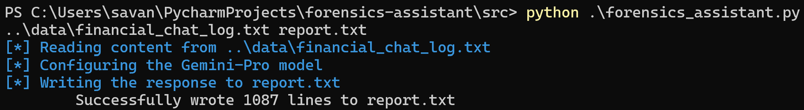

# Forensics Assistant


## Description
forensics_assistant.py aids in the forensic investigation process by utilizing Google's Gemini-Pro model to read chat 
logs from a forensic investigation and extract relevant information to an output file. This can greatly improve the 
efficiency and accuracy of analyzing evidence.

## Project Structure
```
Malware Detection
│   README.md
│   ...
│
└───data
│   │   financial_chat_log.txt
│   │   PII_chat_log.txt
│
└───src
    │   config.json
    │   forensics_assistant.py
    │   report.txt*
    │   requirements.txt
    │   
```

## Getting Started

### Dependencies
* Python3
* Colorama 
* Termcolor

### Installing
```
# Clone this repository
$ git clone https://github.com/sea7321/forensics-assistant.git

# Go into the repository
$ cd forensics-assistant/src

# Install dependencies
$ pip install -r requirements.txt
```

### Obtaining an API Key
To run the program, you need to create a config.json file and replace the api_key variable with your own Gemini API Key 
from Google AI Studio: https://ai.google.dev/

```
{
    "api_key": "your_api_key_here"
}
```

### Executing program

```
# Run the forensics assistant
$ python3 forensics_assistant.py <input_filename> <output_filename>
```


## Author
* Savannah Alfaro, sea2985@rit.edu